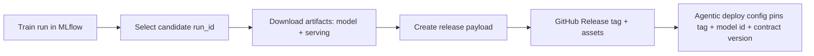
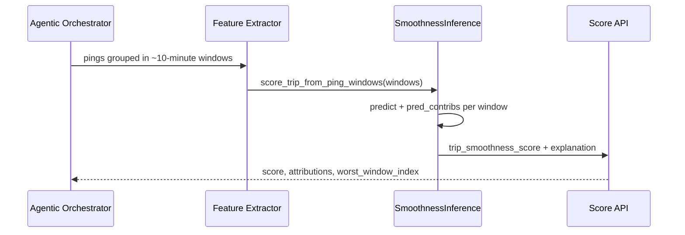
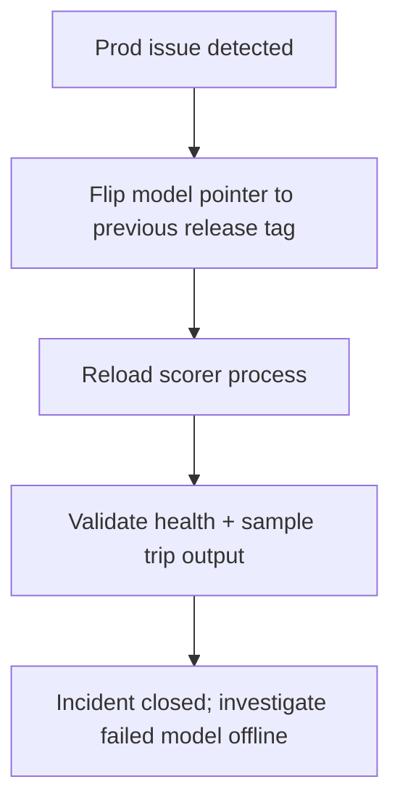

# Agentic Scoring Deployment Handoff

Technical handoff for deploying the smoothness model into an agentic AI scoring service.

This repo has two scoring contracts. Pick one and do not mix artifacts:

- `SmoothnessInference` (production path): 3-feature ping windows (`accel_fluidity`, `driving_consistency`, `comfort_zone_percent`)
- `DeviceAggregateTripScorer` (device aggregate path): 18-feature `smoothness_log` envelopes

---

## 1) What to pin for a release

Use immutable identifiers in deployment config (not "latest"):

- GitHub Release tag (from `.github/workflows/release-package.yml`)
- Model artifact file (`models/*.joblib`)
- Model contract bundle (`serving/model_contract.json`, `serving/background_features.json`)
- Source commit SHA

> Current release workflow uploads `models/*.joblib`.  
> For runtime contract validation, the deploy package must also include `serving/` files from the selected MLflow run.



---

## 2) Recommended deploy package layout

Use one folder per model variant:

```text
model_bundle/
  model.joblib
  serving/
    model_contract.json
    background_features.json
    config_snapshot_production_mlops.yaml   # optional, good for audit
```

`model_contract.json` is authoritative for feature order and versioning.

---

## 3) Runtime wiring in the agentic system

### A. Ping-window path (default production)



Runtime API:

- Load once at startup:
  - `SmoothnessInference.from_local_paths(model_path, serving_dir)`
  - or `SmoothnessInference.from_run(run_id, tracking_uri)`
- Per request:
  - `score_trip_from_ping_windows(windows)` for trip-level scoring
  - `score_window(pings)` only for legacy single-window response shape

### B. Device aggregate path (only if upstream sends `smoothness_log`)

- Class: `DeviceAggregateTripScorer`
- Method: `score_trip_at_end(envelopes)`
- Requires the 18-feature contract; incompatible with the 3-feature bundle.

---

## 4) Contract and compatibility rules

Hard requirements before go-live:

1. `model_contract.json.feature_columns` exactly matches runtime feature order.
2. `contract_version` accepted by the deployed scorer.
3. Input schema matches chosen path:
   - Ping path: each ping has `acceleration_ms2`, `speed_kmh`
   - Device path: envelope contains expected `smoothness_log` aggregate structure
4. Health check validates model load + one synthetic inference.

Fail closed on contract mismatch (return deployment/startup error, not degraded scoring).

---

## 5) Minimal deployment checklist

- Pick winning candidate (`run_id`) from MLflow compare view.
- Build bundle: `model.joblib` + `serving/` files from same run.
- Publish bundle under a GitHub Release tag.
- Pin tag + contract version in agentic service config.
- Smoke test in pre-prod:
  - one normal trip
  - one edge trip (sparse pings / noisy behavior)
- Verify output fields:
  - `trip_smoothness_score`
  - `explanation.feature_attributions`
  - `explanation.worst_window_index`

---

## 6) Rollback model strategy

Keep previous release bundle available and switch by config:



No retraining is required for rollback if bundles are immutable and pinned.

