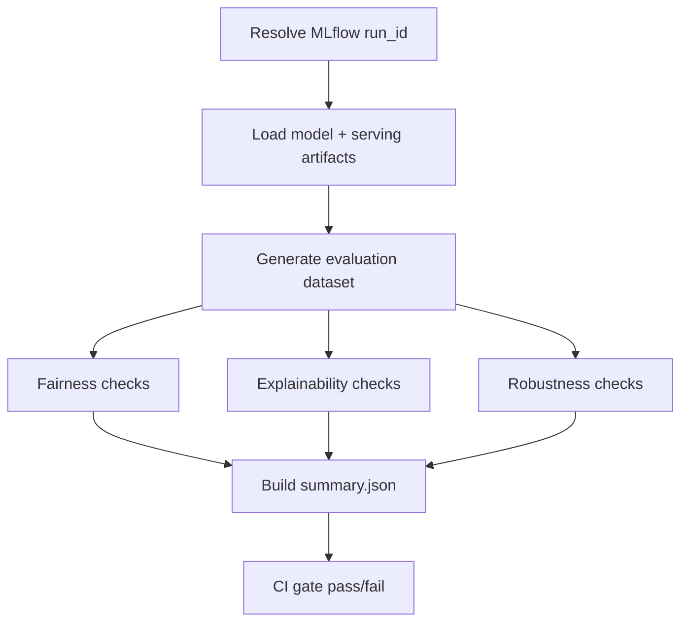
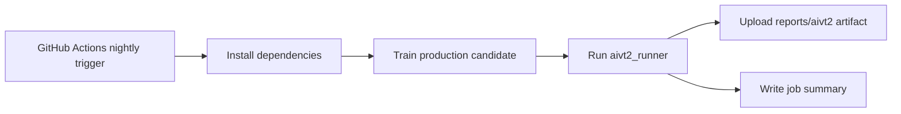

# AIVT2 compliance in TraceData ML

This document explains:

1. what AIVT2 means for this repo,
2. how compliance runs are executed,
3. the latest local results for the production smoothness model,
4. how CI and nightly pipelines enforce it.

Reference: [AIVT 2.0 Features](https://aiverify-foundation.github.io/aiverify/introduction/AIVT%202.0%20features/).

---

## What AIVT2 means here

AI Verify Toolkit 2.0 has two major layers:

- **Process checklist** (governance/process evidence)
- **Technical tests** (fairness, explainability, robustness)

In this repository, we currently run an **AIVT2-aligned technical compliance pipeline** for the production 3-feature model (`SmoothnessInference`). The runner produces CI-friendly artifacts and pass/fail gates.

Current runner:

- `src/compliance/aivt2_runner.py`

Artifacts:

- `reports/aivt2/<run_id>/summary.json`
- `reports/aivt2/<run_id>/evaluation_rows.json`

---

## Compliance execution flow



Nightly CI flow:



---

## What is tested

### 1) Fairness

- Protected split: `age >= 35` vs `< 35`
- Favorable outcome: prediction `>= 80`
- Metrics:
  - disparate impact
  - statistical parity difference
- Default thresholds:
  - min DI: `0.80`
  - max abs SPD: `0.20`

### 2) Explainability

- Method: XGBoost `pred_contribs` additive decomposition
- Check: prediction reconstruction error (`base + sum(contribs)`)
- Threshold:
  - mean absolute additivity error <= `1e-4`

### 3) Robustness

- Method: feature-noise perturbation
- Check: mean absolute score delta between baseline vs perturbed features
- Threshold:
  - mean abs delta <= `8.0`

---

## Latest local run (executed now)

Command used:

```bash
uv run python -m src.compliance.aivt2_runner --tracking-uri ./mlruns --experiment-name smoothness-10min-production --output-dir reports/aivt2 --eval-samples 500
```

Run context:

- `run_id`: `394dcae11ce544eda6610b7f3719121b`
- overall status: **pass**

Results snapshot:

- **Fairness**: pass
  - DI: `1.1187`
  - SPD: `0.0514`
- **Explainability**: pass
  - mean additivity error: `1.72e-05` (under `1e-4`)
- **Robustness**: pass
  - mean abs score delta: `4.3001` (under `8.0`)
- **Regression snapshot**:
  - MAE: `1.2130`
  - R2: `0.9945`

### Plain-English interpretation of these numbers

Think of this run as a **health check report card** for the model.

| Metric | Your result | What it means in simple terms |
|---|---:|---|
| Overall status | **pass** | The model passed the configured compliance gates in this run. |
| Fairness: disparate impact | `1.1187` | Very close to balanced between age groups. `1.0` is perfect parity; your threshold is `>= 0.8`. |
| Fairness: statistical parity difference | `0.0514` | Only about a 5.1 percentage-point difference between groups on favorable outcomes; small gap, within threshold (`<= 0.2`). |
| Explainability: mean additivity error | `1.72e-05` | Explanations are numerically consistent with predictions; this error is tiny and safely below the limit (`1e-4`). |
| Robustness: mean abs score delta | `4.3001` | On average, small feature perturbations move the score by about 4.3 points; allowed max is 8.0, so stability is acceptable. |
| Regression MAE | `1.2130` | Typical prediction error is around 1.2 score points on this synthetic benchmark (lower is better). |
| Regression R2 | `0.9945` | Model fit is very strong on this benchmark (closer to 1 is better). |

Quick takeaway:

- **Fairness:** no obvious red flag under the selected age split and threshold.
- **Explainability:** attribution math is stable and trustworthy for this model path.
- **Robustness:** model is reasonably stable under light noise.
- **Predictive quality:** very high on this synthetic-style evaluation.

Important caveat:

- These values are from the project’s synthetic evaluation setup. They are useful for CI gating and trend monitoring, but should be re-validated on representative real-world data when available.

---

## CI integration

### Standard CI (`.github/workflows/ci.yml`)

- keeps existing format/lint/test checks
- now includes a compliance smoke check:
  - runs `aivt2_runner` with moderate sample size
  - uploads `reports/aivt2` artifact

### Nightly (`.github/workflows/ci-scheduled.yml`)

- supports manual trigger and scheduled run
- optional `skip_training`
- optional `run_id` override
- configurable evaluation inputs:
  - `eval_samples` (default `500`)
  - `perturbation_noise` (default `0.05`)
  - `explainability_max_mean_additivity_error` (default `1e-4`)
- always uploads compliance artifacts

---

## Manual usage

Local:

```bash
uv run tracedata-mlops compliance --tracking-uri ./mlruns --experiment-name smoothness-10min-production
```

Or directly:

```bash
uv run python -m src.compliance.aivt2_runner --tracking-uri ./mlruns --experiment-name smoothness-10min-production --output-dir reports/aivt2
```

GitHub UI:

- Actions -> `CI: nightly quality + compliance` -> `Run workflow`
- set optional inputs (`run_id`, `skip_training`, thresholds) if needed.

