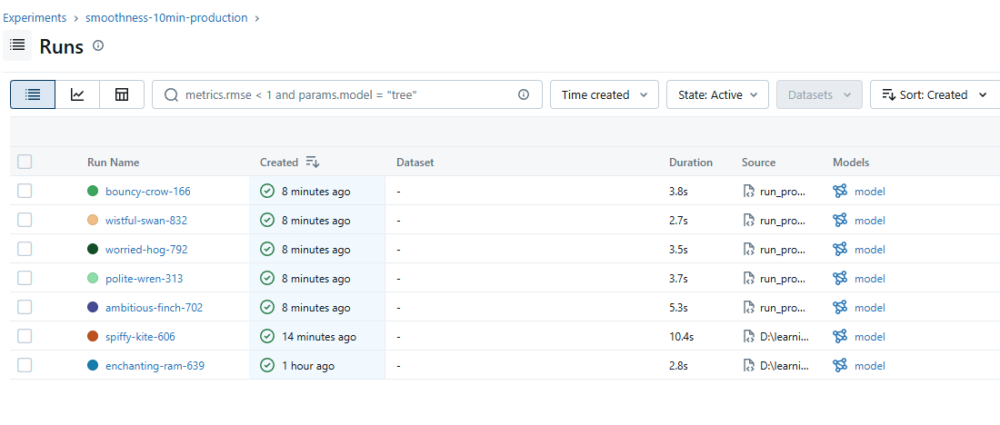
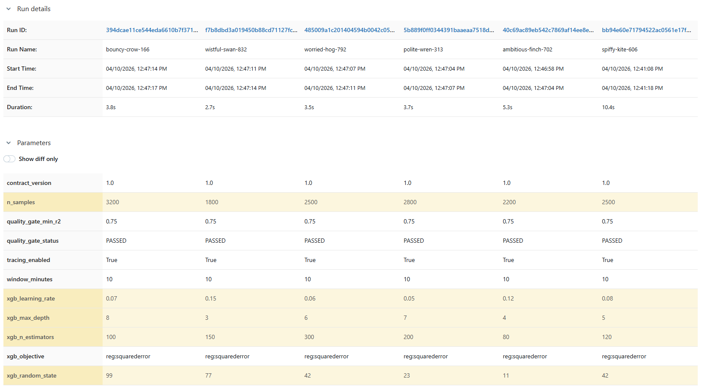
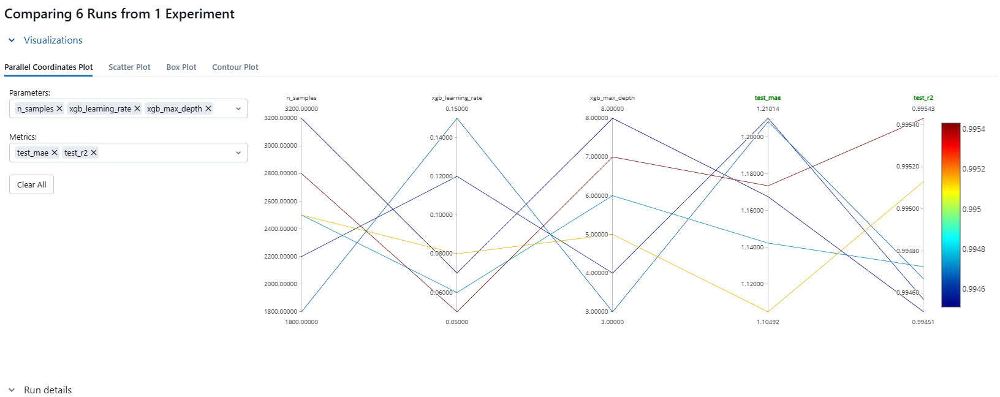
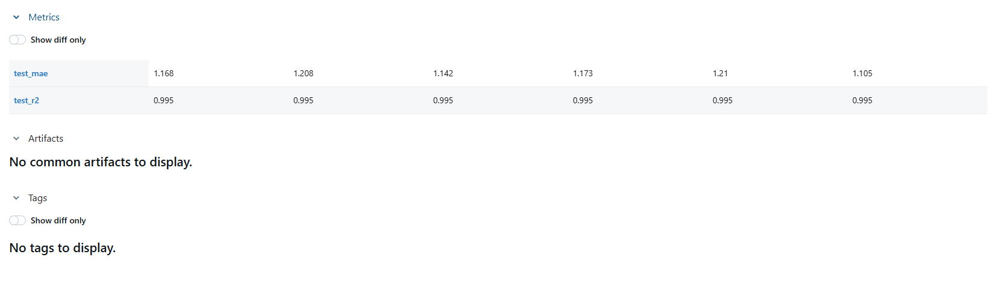

# MLflow parallel coordinates plot — what it means and how to pick a “better” run

This note explains the **Parallel coordinates** chart and related **Compare runs** views in the MLflow UI when you compare multiple training passes of the production smoothness model. The sections below reference **screenshots saved in this folder** (`img-1.png`–`img-4.png`) so you can follow the same UI in your own session.

---

## What you are looking at

- **Each colored polyline (path across vertical axes)** is **one MLflow run** — one full training job with its own logged parameters and metrics.
- **Each vertical axis** is one quantity you chose in the chart builder:
  - Axes on the **left** are usually **parameters** (things you set before or during training, such as `n_samples`, `xgb_learning_rate`, `xgb_max_depth`).
  - Axes on the **right** are usually **metrics** (numbers computed after training on a held-out split, such as `test_mae`, `test_r2`).
- A line **connects one run’s values** across all selected axes. So you can see, at a glance, which combinations of hyperparameters tend to land where on the test metrics.

The chart does **not** train models; it only **visualizes runs you already logged**.

---

## How to read the metrics on the right

For this project’s regression model:

| Metric | Better direction | Plain language |
|--------|------------------|----------------|
| **`test_r2`** | **Higher** | How much of the variance in the test labels the model explains (1.0 = perfect on that split; lower = more error). |
| **`test_mae`** | **Lower** | Average absolute error between predicted and true smoothness on the **test** split. |

So a run is **better** on the test split if **`test_r2` is higher** and **`test_mae` is lower** (all else equal).

---

## What the color scale usually means

MLflow often colors lines by **one metric** (commonly the same one you care most about optimizing). In the parallel-coordinates screenshot below, the color bar is tied to **`test_r2`**:

- **Warmer / red** → **higher** `test_r2` (better fit on the test split).
- **Cooler / blue** → **lower** `test_r2` (worse fit on the test split).

Use the color bar labels to map exact values. A **strong** run is one whose line sits high on `test_r2` and low on `test_mae`, and typically appears **red** when color encodes `test_r2`.

---

## Screenshots and how we use them to choose parameters and a run

The following images are from the **`smoothness-10min-production`** experiment after several intentional “tune-up” training passes (different XGBoost settings and sample counts). Together they answer: **what did we vary, why, and where do we actually decide?**

### 1. Experiment runs list — context and shortlisting

**What this shows.** The **Runs** table lists every completed job in the experiment (names like `bouncy-crow-166`, `wistful-swan-832`, etc.). You see **when** each run finished, **how long** it took, and that each run logged a **model** artifact. The **Source** column distinguishes batches (for example a script-driven tuning batch vs an earlier single training from a local path).

**Why it matters for a release.** This is the **inventory**: all candidates must appear here and finish successfully before you compare them. Any **filter** you apply in the search bar (the UI may show an example filter such as `metrics...` and `params...`) is an explicit **shortlisting rule** — only runs that match are in view. For a software release you typically then open **Compare** on the runs you care about and drill into parameters and metrics (next screenshots).

**What we are *not* deciding here.** We are not picking the winning hyperparameters from this table alone; we use it to **select which runs to compare** side by side.

---

### 2. Compare runs — which parameters we changed and why

**What this shows.** The **Parameters** grid lists everything MLflow logged for each run. Rows that **differ** across columns are the ones that defined the tuning experiment.

**What we held constant (and why).** The same values appear in every column for:

- **`contract_version`**, **`window_minutes`**, **`xgb_objective`** — the **problem definition** (3-feature contract, 10-minute windows, regression objective) must not drift during a hyperparameter sweep; otherwise you are comparing different tasks.
- **`quality_gate_min_r2`** and **`quality_gate_status: PASSED`** — every run shown **met the minimum bar** configured in `production_mlops.yaml` (`model.quality_gate.min_r2_score`). That is an **automated veto**: runs that fail the gate are not candidates for promotion unless you change policy.
- **`tracing_enabled: True`** — tracing was on for observability; it does not pick the winner but documents the pipeline in the **Traces** tab.

**What we varied (and why).**

| Parameter | Role in the sweep |
|-----------|-------------------|
| **`n_samples`** | More synthetic windows → potentially more stable estimates of generalization; we swept roughly **1800–3200** to see sensitivity to data volume. |
| **`xgb_learning_rate`** | Step size for boosting; **lower** often smooths training, **higher** can converge faster but overshoot. Range **0.05–0.15** explores speed vs stability. |
| **`xgb_max_depth`** | Tree capacity / nonlinearity; **deeper** trees can fit more complex patterns but overfit more easily. Range **3–8** brackets shallow vs deep. |
| **`xgb_n_estimators`** | Number of trees; interacts with learning rate (many weak trees vs fewer strong ones). Range **80–300** covers light vs heavy ensembles. |
| **`xgb_random_state`** | **Different seeds** per configuration so the split and sampling are reproducible *per run* but not identical across runs — reduces “one lucky split” conclusions when comparing configs. |

**Where the decision starts.** This view is where you confirm: *we only changed what we meant to change*, and *everything that should be fixed really is fixed*. The **next** step is to see how those choices map to metrics — visually (parallel coordinates) and numerically (metrics table).

---

### 3. Parallel coordinates — pattern across the sweep

**What this shows.** **Six runs**, **five axes**: `n_samples`, `xgb_learning_rate`, `xgb_max_depth`, then **`test_mae`**, **`test_r2`**. Each **polyline** is one run. Color encodes **`test_r2`** (blue ≈ lower R², red ≈ higher R² on the scale shown).

**How to read it for “better” vs “worse”.**

- **Strongest line on R² (typically the reddest):** In this plot, the best **`test_r2`** aligns with **lower learning rate** (toward **0.05**), **higher depth** (around **7**), and **more samples** in the **~2800** region — not the extreme high sample count paired with bad other settings (see below).
- **Weakest line on R² (typically the bluest):** The poorest **`test_r2`** and highest **`test_mae`** in this comparison correspond to **high learning rate (0.15)** and **shallow trees (depth 3)** — a **fast, under-expressive** learner on this task underperforms even when sample count is large (**3200**), which illustrates that **more data does not fix a bad capacity / learning-rate pairing** in this grid.
- **Lowest MAE vs highest R²:** On synthetic data the metrics are **very close** across runs. The **lowest `test_mae`** in the full comparison may belong to a **different** line than the absolute peak **`test_r2`** (different color). That is normal: you choose a **primary objective** (e.g. minimize MAE if errors are costlier, or maximize R² if variance explained is the headline metric) or a **weighted trade-off**.

**Why we use this chart.** It gives **geometry**: you see whether “more depth + lower LR” consistently moves lines toward better **`test_r2`**, without reading six tables. It supports **intuition for the next experiment** (e.g. narrow LR around 0.05–0.07), not a mathematical proof of global optimality.

---

### 4. Metrics table — numeric tie-break and release-oriented choice

**What this shows.** The same compared runs, **Metrics** only: **`test_mae`** and **`test_r2`**. The UI may **round** R² in the table (e.g. **0.995** for all columns) while the parallel plot color bar shows **finer separation** — always use **full-precision metrics** in the run detail page when two runs look tied.

**How to choose a “better” run from this screen.**

- If **`test_r2` is effectively tied** across candidates (as in the screenshot), **`test_mae`** is a sensible **tie-breaker**: **lower MAE** means smaller average absolute error on the held-out split.
- In this screenshot, **one run** achieves the **lowest `test_mae` (~1.105)** while keeping the same rounded **`test_r2`** as the others — that run is the **numeric favorite** if your policy is “minimize MAE among gate-passing runs with similar R².”
- **Map back to parameters:** open that column’s **Parameters** in the same Compare view (previous image) to see the exact **`xgb_*`** and **`n_samples`** to copy into `production_mlops.yaml` or into your release manifest (`run_id` / model URI).

**Caveat.** This is still **synthetic** test data and **one** split per run; for a production software release, add **held-out real or pilot data**, **multiple seeds**, and **non-metric** checks (latency, contract compatibility) as documented in your release process.

---

## Synthesis: where we actually make the decision

1. **Quality gate** (`quality_gate_status`, `quality_gate_min_r2`) — automatic; failed runs drop out (see parameters screenshot).
2. **Compare parameters** — confirm only intended knobs moved; contract and windowing unchanged.
3. **Parallel coordinates** — see **directional** effects (LR, depth, sample size) and color-by-R².
4. **Metrics table** — **numeric** ranking; use **MAE** (or another metric) to break near-ties in R².
5. **Release record** — pin **`run_id`** (or registry version) and align config; do **not** rely on chart color alone.

That pattern is **useful for intuition and for choosing the next experiment**, but it is **not a guarantee** that those settings are optimal on real fleet data or on a different random seed / data mix.

---

## Important caveats (unchanged)

1. **Synthetic data** — Scores reflect the simulator and label definition (`smoothness_label`), not real roads or sensors. A winner on these charts is a winner **in this experiment**, not automatically in production.
2. **Correlation, not proof** — Parallel coordinates show **what happened across a few runs**. They do not prove causality; another run with different `n_estimators` or seed could change the ranking.
3. **Overfitting** — Very flexible settings (deep trees, many rounds) can look great on a single test split but generalize worse on new domains. Use multiple seeds, more data, or cross-validation when decisions matter.
4. **Narrow metric scope** — `test_mae` / `test_r2` are only two views. Latency, stability, fairness, and drift are not on this chart.

---

## Practical next steps

- In MLflow, open the **best** run for your chosen objective (e.g. lowest `test_mae` among similar `test_r2`), note **`run_id`** and **Parameters**, and align `production_mlops.yaml` if you want that recipe as the default for the next training.
- Re-run training with **new random seeds** or a **narrowed** hyperparameter band to see if the ranking stays stable.
- For demos, use **parallel coordinates** to explain **trade-offs** between sample size, learning rate, and tree depth at a glance.

---

## Related

- Training entrypoints and MLflow storage: [GETTING_STARTED.md](GETTING_STARTED.md) (Steps 3–4).
- Production config: `production_mlops.yaml` at the repo root.
