# TraceData ML Pipeline: A Guide for Fullstack Developers

> **Run the repo first:** **[GETTING_STARTED.md](GETTING_STARTED.md)** (copy-paste steps).  
> This guide is a **long analogy-based explainer**—optional after you have a working train + predict loop.

> **Who this is for:** You know what a REST API, a database, and a Docker container are. You've never trained an ML model.
> **How to read this:** Every ML concept will be mapped to something you already understand.

---

## The One-Sentence Summary

This system takes raw sensor readings from a car, runs them through a math formula stored in a file, and produces a score — the same way a REST API takes a JSON body, processes it in a service class, and returns a response. The "ML" part is just an unusually smart service class.

---

## 🗺️ The Whole System at a Glance

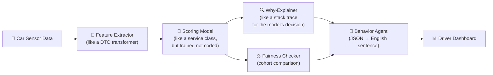

---

## Stage 1: Getting Data In

### Telemetry = A Stream of Events

Think of telemetry like **server access logs** — except instead of HTTP requests, you are logging what a car is doing every 30 seconds.

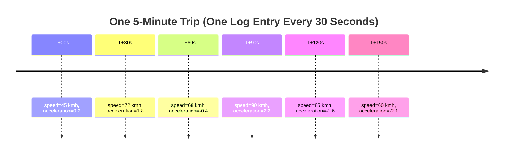

### The Database Schema

This is just a **normalized relational database**. Nothing unfamiliar here.

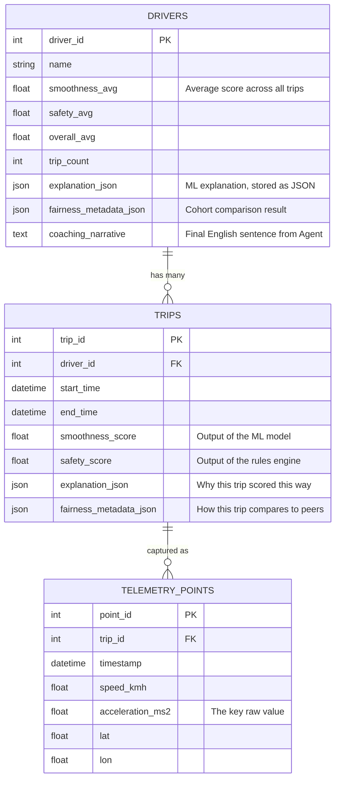

---

## Stage 2: Feature Engineering — The "DTO Transformation" of ML

### The Problem

A model cannot understand "this driver brakes harshly." It only understands **numbers in columns**, same as how your backend cannot process a blob of text — it needs a structured DTO.

**Feature Engineering is converting raw sensor arrays into a structured row of meaningful numbers.** You are the translator between physics and math.

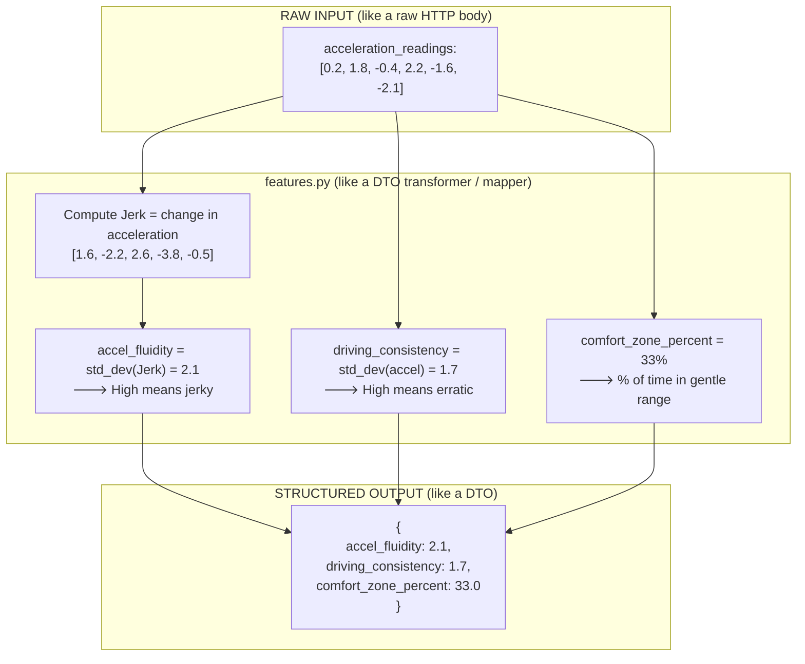

| Feature | Your Domain Analogy | Meaning |
| :--- | :--- | :--- |
| `accel_fluidity` | Response time variance across API calls | High = unstable / jerky |
| `driving_consistency` | Throughput variance across requests | High = unpredictable load behavior |
| `comfort_zone_percent` | % of requests under SLA threshold | High = mostly gentle driving |

---

## Stage 3: ML Training — "Compiling" Business Logic

### The Core Insight

In traditional development, you **write** business logic: `if speed > 120 => deduct points`.

In ML, you **show** the system thousands of examples and let it figure out the logic itself. Training is the equivalent of **compilation** — you do it once offline, and the output is a binary artifact you ship.

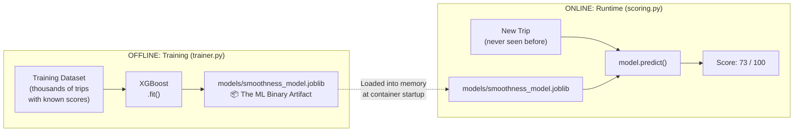

> **Analogy:** The `.joblib` file is equivalent to a compiled `.jar` or `.dll`. You do not recompile on every request. You load it once and call it.

### The Training Loop (Step-by-Step)

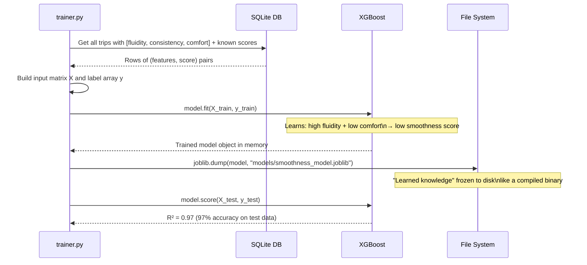

---

## Stage 4: Inference — Calling the Trained Service

"Inference" is the ML word for **running the model at runtime to get a prediction**. Think of it like calling a service method. The model is just a really complex `calculateScore(features)` function.

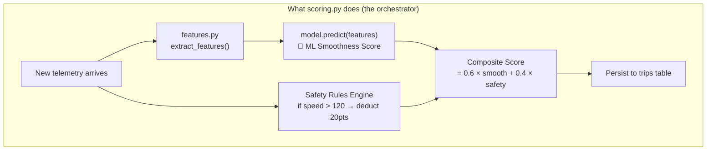

> **Why use ML for smoothness but rules for safety?**
>
> Safety is **objective**: you either violated a speed limit or you did not. A rule is better.
> Smoothness is **subjective**: what feels smooth varies. An ML model trained on patterns is better.

---

## Stage 5: Explainability (XAI) — The Stack Trace for ML Decisions

### The Problem
The model gives you a score of 62. You cannot ship that to a driver without explaining *why*. In software, when something fails, you read the stack trace. In ML, you use **SHAP** to produce the equivalent.

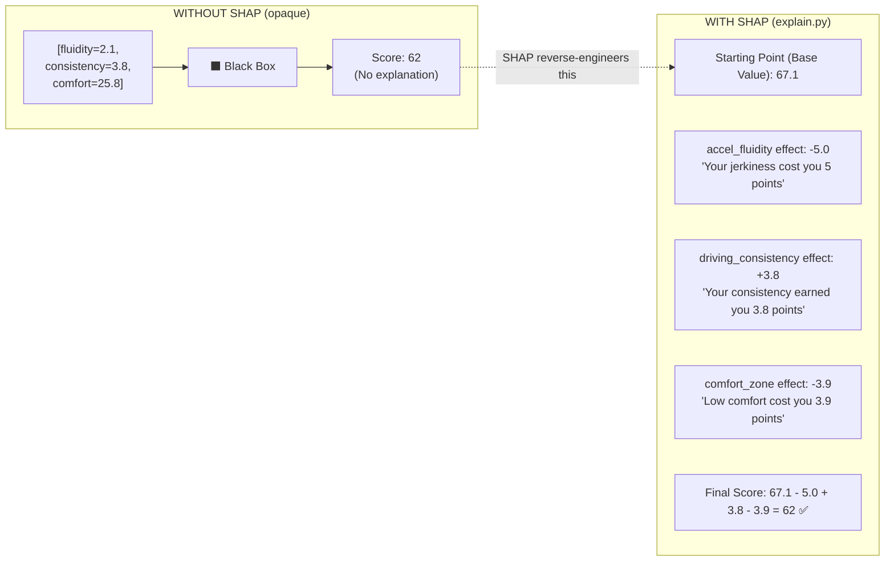

### Two Levels of Explanation

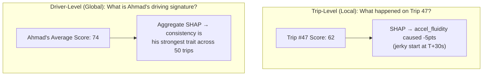

---

## Stage 6: Fairness — Is the Score Context-Aware?

### The Question
If a 68-year-old driver scores 70 — is that good or bad? Without context, we don't know. Fairness analysis adds cohort benchmarking.

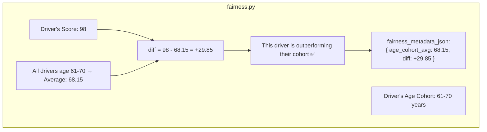

### The Design Decision: Show Context, Never Change the Score

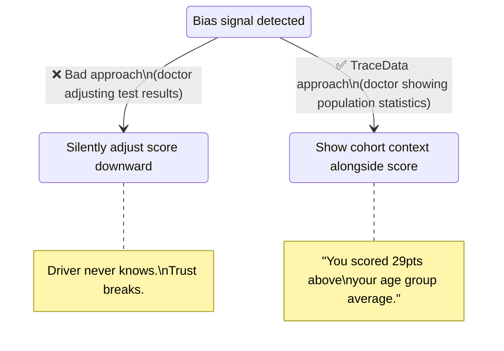

---

## Stage 7: The Behavior Agent — Converting JSON to English

### Why This Exists

All the stages above produce **structured JSON**. Your drivers are not data scientists. They need a sentence, not a dictionary. The Behavior Agent does this translation.

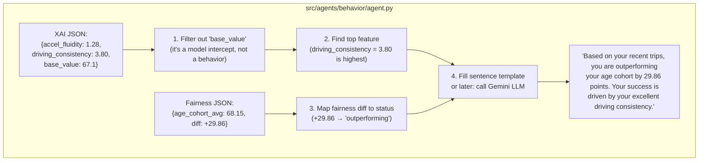

---

## Stage 8: Deployment — MLOps Is Just DevOps for Models

### The Full Picture

MLOps = DevOps + the additional concern of managing ML artifacts (model files) and ensuring that what you trained offline is exactly what runs at production.

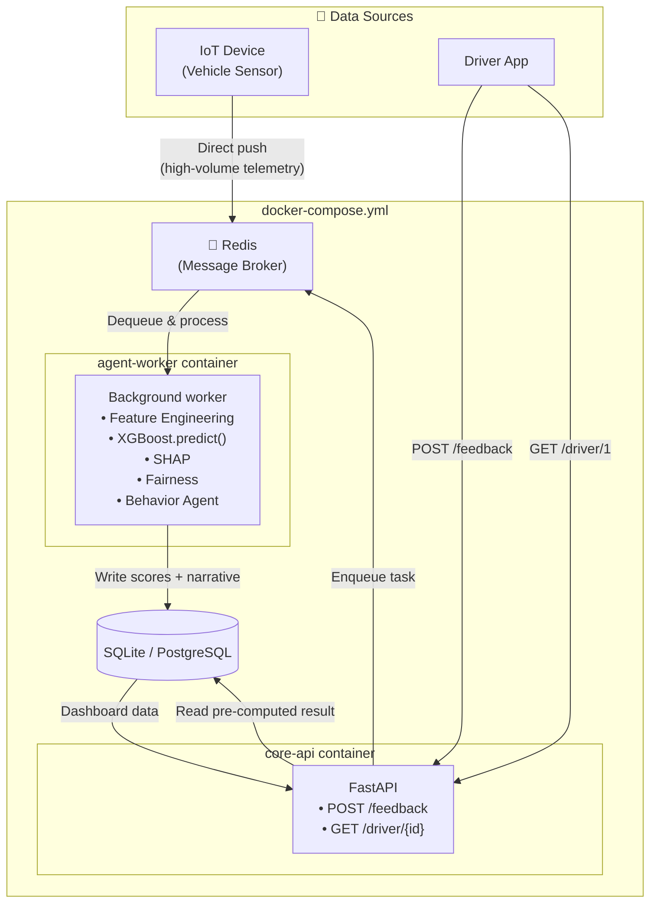

### Why Two Containers?

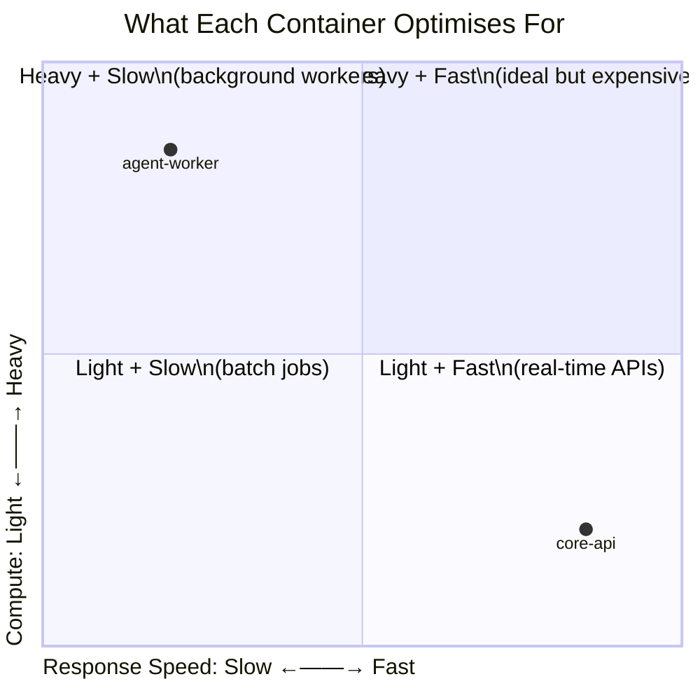

**`core-api`** must be fast because a user is waiting. It only reads from the database.

**`agent-worker`** can be slow because it runs in the background. It does all the heavy computation (ML inference, SHAP, LLM).

---

## End-to-End: The Complete Request Journey

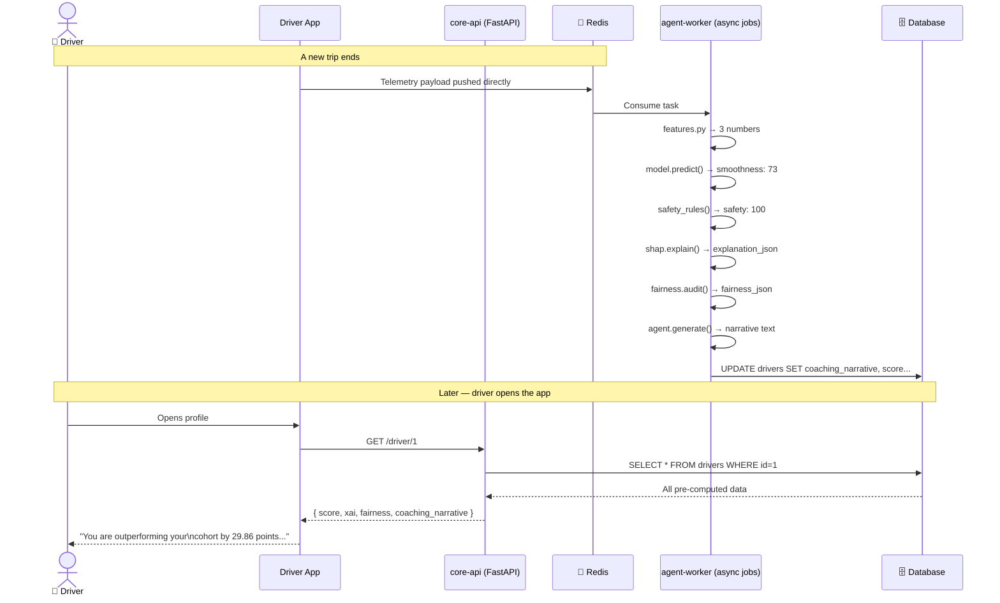

---

## 📂 Where to Find Everything

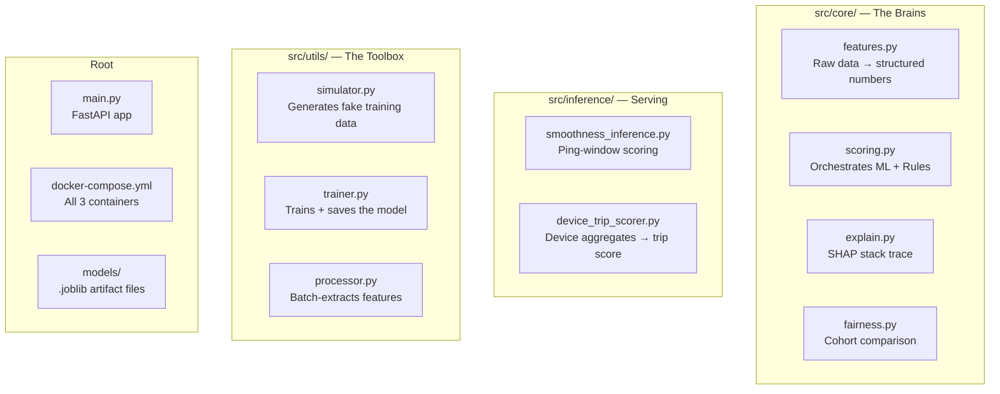

---

## 📖 Glossary: ML → Fullstack Translations

| ML/AI Term | What You Already Know | TraceData File |
|:---|:---|:---|
| **Feature Engineering** | DTO transformation / data mapping | `src/core/features.py` |
| **Training** | Compiling code from source | `src/utils/trainer.py` |
| **Model Artifact** | A compiled `.jar` or `.dll` binary | `models/smoothness_model.joblib` |
| **Inference** | Calling a service method at runtime | `model.predict()` in `scoring.py` |
| **SHAP (XAI)** | A stack trace for the model's decision | `src/core/explain.py` |
| **Fairness Auditing** | A/B comparison with population stats | `src/core/fairness.py` |
| **Synthetic Data** | Mocked unit test data | `src/utils/simulator.py` |
| **Model Drift** | A memory leak that accumulates over time | *(Future monitoring phase)* |
| **MLOps** | DevOps — but also managing the model artifact lifecycle | `tracedata-mlops` CLI + MLflow |
