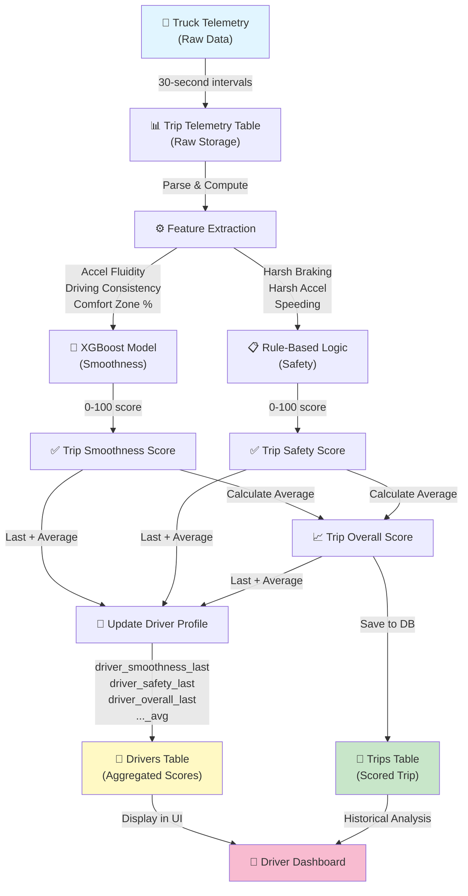
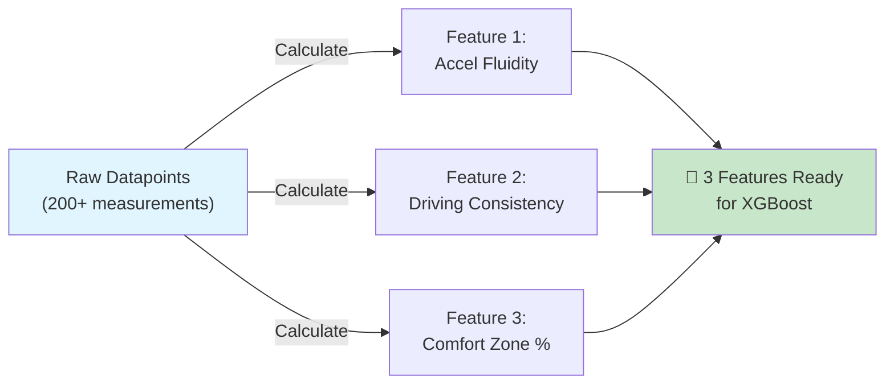
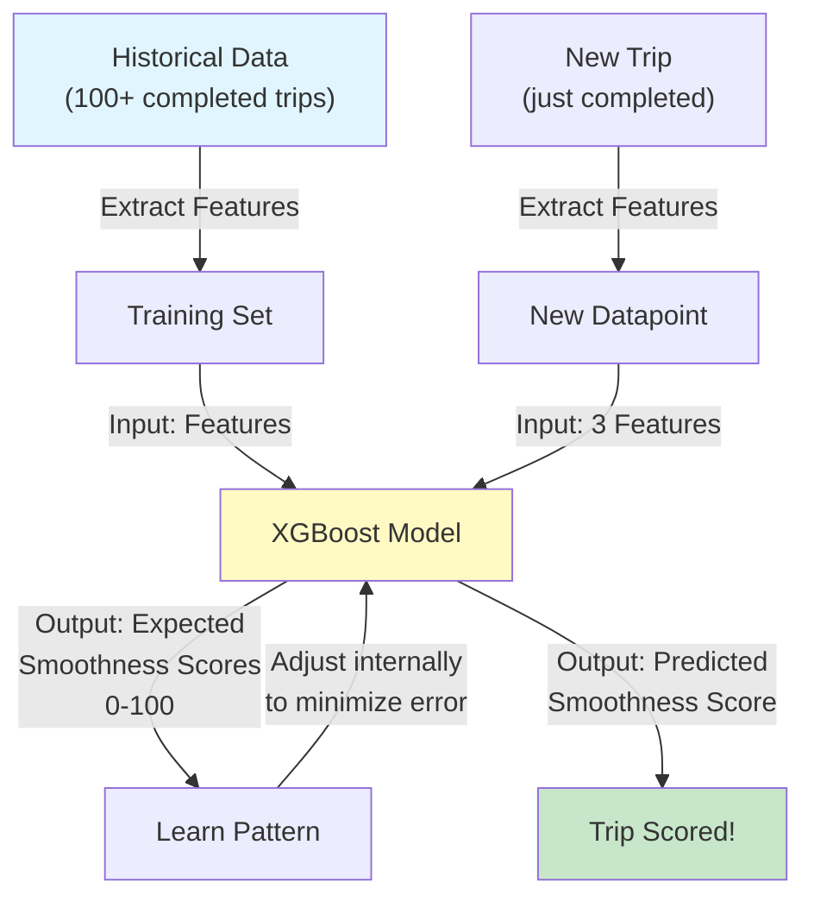
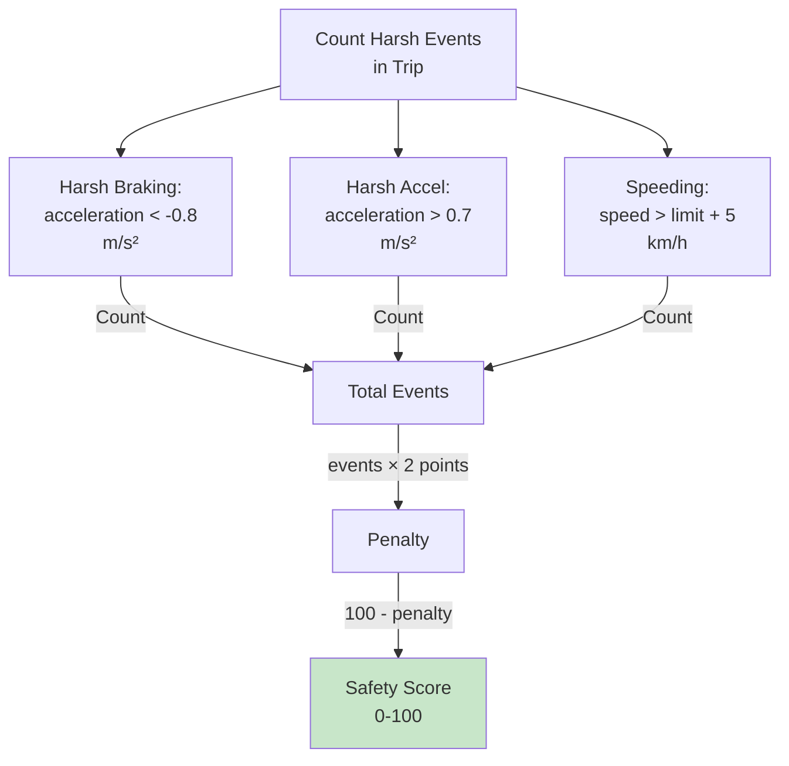
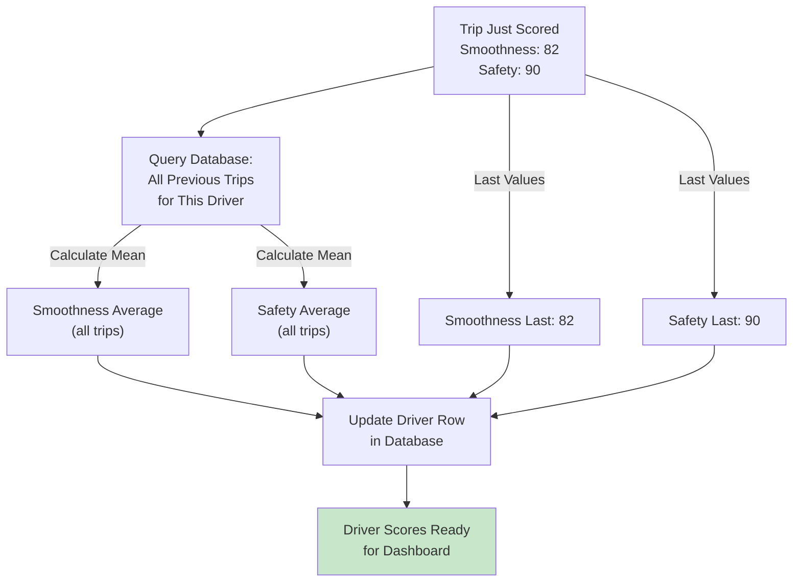
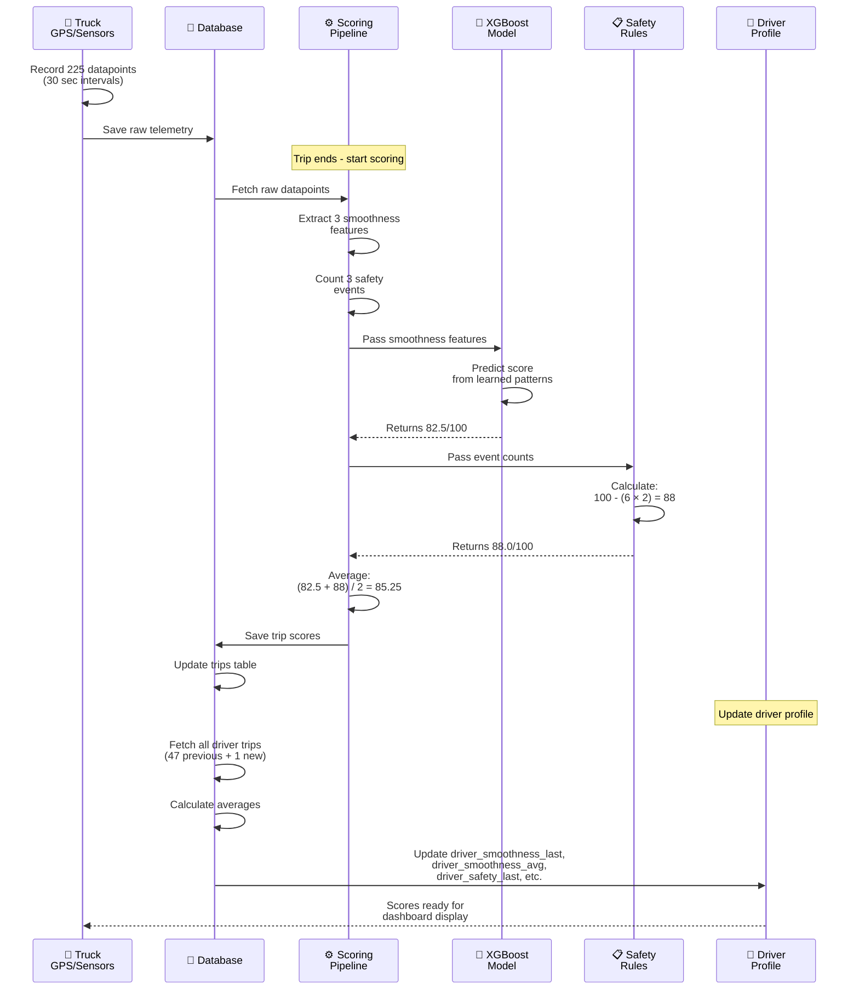
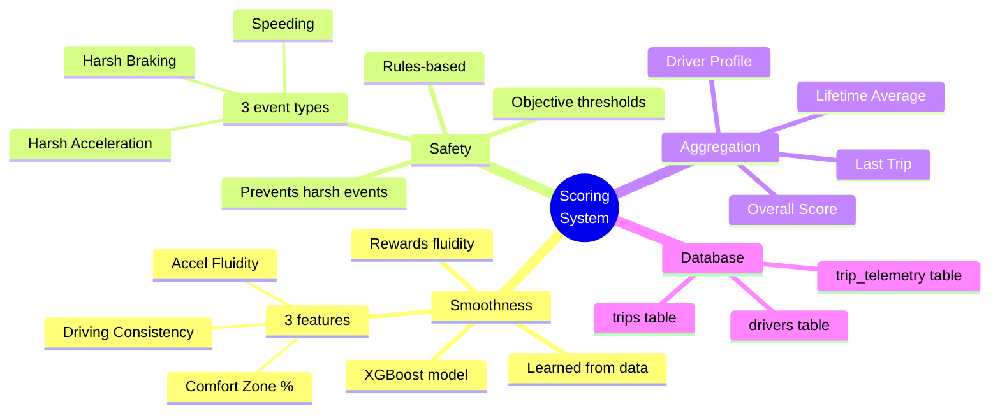

# TraceData Scoring System: A Beginner's Guide

> **Hands-on first:** open **[GETTING_STARTED.md](GETTING_STARTED.md)** and run the commands there (about 10 minutes).  
> This file is a **long conceptual walkthrough**—use the table of contents; you do not need to read it in one sitting.

## Understanding Trip & Driver Smoothness and Safety Scoring

---

## Table of Contents

1. [What Are We Building?](#what-are-we-building)
2. [Core Concepts](#core-concepts)
3. [The Big Picture: Data Flow](#the-big-picture-data-flow)
4. [Understanding the Database Schema](#understanding-the-database-schema)
5. [Step 1: Raw Telemetry Data](#step-1-raw-telemetry-data)
6. [Step 2: Feature Extraction](#step-2-feature-extraction)
7. [Step 3: XGBoost Smoothness Scoring](#step-3-xgboost-smoothness-scoring)
8. [Step 4: Rule-Based Safety Scoring](#step-4-rule-based-safety-scoring)
9. [Step 5: Driver Aggregation](#step-5-driver-aggregation)
10. [Implementation Guide](#implementation-guide)

---

## What Are We Building?

We're creating a **scoring system** for truck drivers that measures two independent things:

1. **Smoothness Score** (0-100): How fluidly does the driver accelerate and brake?
2. **Safety Score** (0-100): Does the driver avoid harsh braking, harsh acceleration, and speeding?

At the end of each trip, the system:

- Scores the trip using both metrics
- Aggregates all trips into a driver profile
- Shows the driver their last trip score + lifetime average

**Why two separate scores?**

- A driver might be safe (no speeding) but jerky (harsh braking)
- A driver might be smooth but occasionally exceed the speed limit
- By separating them, we reward different behaviors and give clearer feedback

---

## Core Concepts

### 1. **Smoothness** – How Comfortable is the Ride?

Imagine you're sitting in a truck. A **smooth driver**:

- Accelerates gradually (no jerks)
- Brakes gently (no sudden stops)
- Keeps acceleration changes steady
- Stays in a comfortable acceleration band (-0.5 to +0.5 m/s²)

**Why it matters:**

- Passenger comfort
- Less wear on the vehicle
- Better fuel efficiency
- Professional driving behavior

**How we measure it (3 features):**

```
1. Accel Fluidity (Jerk)
   - How much does acceleration change from moment to moment?
   - Low jerk = smooth
   - High jerk = jerky

   Real-world example:
   ✓ Good: [0.2, 0.21, 0.22, 0.21, 0.20] → very smooth acceleration
   ✗ Bad:  [0.2, 0.8, -0.1, 0.6, 0.1] → all over the place

2. Driving Consistency (Variance)
   - Is acceleration value similar throughout the trip?
   - Low variance = consistent and smooth
   - High variance = erratic

   Real-world example:
   ✓ Good: Average accel = 0.25, mostly 0.2-0.3 (low spread)
   ✗ Bad:  Average accel = 0.25, ranges from -0.8 to +0.9 (high spread)

3. Comfort Zone %
   - What % of time is the driver in the comfortable band?
   - Comfortable = acceleration between -0.5 and +0.5 m/s²
   - Higher % = smoother driver

   Real-world example:
   ✓ Good: 92% of datapoints in [-0.5, +0.5] range
   ✗ Bad:  45% of datapoints in [-0.5, +0.5] range
```

**Then we use XGBoost to learn:** "Given these 3 features, what's the smoothness score?"

The model is trained on historical data and learns patterns of smooth driving.

---

### 2. **Safety** – Does the Driver Follow Rules?

A **safe driver**:

- Doesn't exceed speed limits
- Avoids harsh braking (sudden stops)
- Avoids harsh acceleration (sudden takeoffs)
- Follows road rules consistently

**Why it matters:**

- Accident prevention
- Regulatory compliance
- Risk reduction

**How we measure it (3 counts):**

```
1. Harsh Braking Count
   - How many times did the driver brake harder than -0.8 m/s²?
   - Real-world: Emergency brake = -0.8 to -1.0 m/s²
   - Rule: If acceleration < -0.8 m/s², count it

   Real-world example:
   ✓ Good: 1 harsh brake in a 1-hour trip
   ✗ Bad:  15 harsh brakes in a 1-hour trip

2. Harsh Acceleration Count
   - How many times did the driver accelerate harder than +0.7 m/s²?
   - Real-world: Aggressive takeoff = +0.7 m/s²
   - Rule: If acceleration > +0.7 m/s², count it

   Real-world example:
   ✓ Good: 2 harsh accels in a 1-hour trip
   ✗ Bad:  20 harsh accels in a 1-hour trip

3. Speeding Events Count
   - How many times did the driver exceed the speed limit by >5 km/h?
   - Rule: If speed > (limit + 5 km/h), count it

   Real-world example:
   Speed limit = 90 km/h, so >95 km/h = speeding event
   ✓ Good: 0-2 speeding events per hour
   ✗ Bad:  10+ speeding events per hour
```

**Safety Score Calculation (Simple Rule):**

```
Safety Score = 100 - (Total Harsh Events × 2 points per event)

Example:
- Harsh braking: 3 events
- Harsh acceleration: 2 events
- Speeding: 1 event
- Total: 6 events × 2 = 12 points penalty
- Safety Score = 100 - 12 = 88/100
```

---

### 3. **Overall Score** – The Headline Metric

```
Overall Score = (Smoothness Score + Safety Score) / 2

Example:
- Smoothness: 85/100
- Safety: 88/100
- Overall: (85 + 88) / 2 = 86.5/100
```

Use the overall score for quick driver ranking. Use smoothness + safety separately to give targeted feedback.

---

## The Big Picture: Data Flow



---

## Understanding the Database Schema

### The Three Tables

#### 1️⃣ **`drivers` Table** – Who Are Our Drivers?

```
drivers
├── driver_id (Primary Key)
├── name
├── email
├── phone
├── 📊 Last Trip Scores
│   ├── driver_smoothness_last
│   ├── driver_safety_last
│   └── driver_overall_last
├── 📈 Lifetime Averages
│   ├── driver_smoothness_avg
│   ├── driver_safety_avg
│   └── driver_overall_avg
├── trip_count (how many trips scored)
└── timestamps (created_at, updated_at)
```

**Example Data:**

```
driver_id: 1
name: "Ahmad Roni"
driver_smoothness_last: 82.50
driver_smoothness_avg: 78.30
driver_safety_last: 95.00
driver_safety_avg: 89.40
driver_overall_last: 88.75
driver_overall_avg: 83.85
trip_count: 47
```

**Why two scores (last + average)?**

- Last trip: "How did I do today?"
- Average: "Am I generally a good driver?"

---

#### 2️⃣ **`trips` Table** – What Happened on Each Trip?

```
trips
├── trip_id (Primary Key)
├── driver_id (Foreign Key → drivers table)
├── truck_id
├── ⏱️ Trip Timeline
│   ├── start_time
│   ├── end_time
│   ├── duration_seconds
│   └── distance_km
├── 🚨 Raw Event Counts
│   ├── harsh_braking_count
│   ├── harsh_acceleration_count
│   └── speeding_events
├── 🎯 Computed Scores
│   ├── trip_smoothness_score (XGBoost output)
│   ├── trip_safety_score (Rule-based output)
│   └── trip_overall_score (Average)
├── 🔍 Intermediate Features (for debugging)
│   ├── accel_fluidity
│   ├── driving_consistency
│   └── comfort_zone_percent
└── timestamps (created_at)
```

**Example Data:**

```
trip_id: 1001
driver_id: 1
truck_id: 42
start_time: 2024-01-15 06:00:00
end_time: 2024-01-15 09:45:00
duration_seconds: 13500 (3.75 hours)
distance_km: 187.5
harsh_braking_count: 2
harsh_acceleration_count: 1
speeding_events: 3
trip_smoothness_score: 82.50
trip_safety_score: 90.00 (100 - (6 events × 2 penalty))
trip_overall_score: 86.25 ((82.50 + 90.00) / 2)
accel_fluidity: 0.1250
driving_consistency: 0.3847
comfort_zone_percent: 87.50
```

---

#### 3️⃣ **`trip_telemetry` Table** – Raw Data Points

```
trip_telemetry
├── telemetry_id (Primary Key)
├── trip_id (Foreign Key → trips table)
├── data_points (JSONB Array)
│   └── [ point1, point2, point3, ... ]
│       └── Each point: {
│           timestamp,
│           lat,
│           lon,
│           speed_kmh,
│           acceleration_ms2,
│           braking_force,
│           ...
│       }
└── point_count (how many datapoints in this trip)
```

**Example Data:**

```
trip_id: 1001
point_count: 225 (one datapoint every 30 seconds for 3.75 hours)
data_points: [
  {
    "timestamp": "2024-01-15T06:00:00",
    "lat": 1.3521,
    "lon": 103.8198,
    "speed_kmh": 0,
    "acceleration_ms2": 0,
    "braking_force": 0
  },
  {
    "timestamp": "2024-01-15T06:00:30",
    "lat": 1.3523,
    "lon": 103.8200,
    "speed_kmh": 5.5,
    "acceleration_ms2": 0.18,
    "braking_force": 0
  },
  {
    "timestamp": "2024-01-15T06:01:00",
    "lat": 1.3525,
    "lon": 103.8202,
    "speed_kmh": 10.0,
    "acceleration_ms2": 0.15,
    "braking_force": 0
  },
  ... more points
]
```

---

## Step 1: Raw Telemetry Data

### What Is Telemetry?

**Telemetry** = "Measurement from a distance"

Every truck has sensors that record:

- **Position**: GPS coordinates (latitude, longitude)
- **Speed**: Current velocity (km/h)
- **Acceleration**: Rate of change of speed (m/s²)
  - Positive = speeding up
  - Negative = slowing down
  - Zero = constant speed
- **Time**: Timestamp of each measurement

These measurements happen every **10-30 seconds** (we chose 30 seconds for efficiency).

### Example: A 1-Hour Trip

```
Time          Speed   Accel    Location
06:00:00      0       0.00     Start (truck parked)
06:00:30      5.5     0.18     Accelerating smoothly
06:01:00      10.0    0.15     Still accelerating
06:01:30      15.5    0.18     Continuing
...
06:30:00      55      0.05     Cruising at highway speed
...
06:45:00      45      -0.25    Braking gently
06:45:30      40      -0.30    Still braking
...
07:00:00      0       0.00     Stopped
```

### Why This Raw Data?

It's the **foundation** for everything:

- We extract features (smoothness indicators) from it
- We count events (harsh braking, speeding) from it
- It's the source of truth for audits/transparency

---

## Step 2: Feature Extraction

### What Is Feature Extraction?

**Problem**: XGBoost can't learn from raw 30-second datapoints. It needs **summary features**.

**Solution**: Compute 3 summary features from the raw datapoints.



### Feature 1: Accel Fluidity (Jerk)

**Definition**: "How much does acceleration change from moment to moment?"

**Formula**:

```
Jerk = acceleration at time t+1 - acceleration at time t
Accel Fluidity = Average of |all jerks|
```

**Example Calculation**:

```
Raw accelerations: [0.20, 0.22, 0.18, 0.21, 0.19]

Jerk calculations:
  0.22 - 0.20 = 0.02
  0.18 - 0.22 = -0.04
  0.21 - 0.18 = 0.03
  0.19 - 0.21 = -0.02

Accel Fluidity = (|0.02| + |-0.04| + |0.03| + |-0.02|) / 4
               = (0.02 + 0.04 + 0.03 + 0.02) / 4
               = 0.1125

Interpretation:
✓ Low (0.05-0.15) = very smooth driver
✗ High (0.5+) = jerky, erratic driver
```

---

### Feature 2: Driving Consistency (Variance)

**Definition**: "Is acceleration similar throughout the trip, or all over the place?"

**Formula**:

```
Driving Consistency = Standard Deviation of all accelerations
```

**Example**:

```
Smooth driver:
Accelerations: [0.20, 0.21, 0.22, 0.21, 0.20, 0.19, 0.21]
Std Dev = 0.008 (very tight, all similar)

Erratic driver:
Accelerations: [0.20, 0.80, -0.50, 0.60, -0.30, 0.90, 0.10]
Std Dev = 0.52 (all over the place)
```

---

### Feature 3: Comfort Zone %

**Definition**: "What % of the trip was the driver in the comfortable acceleration band?"

**Formula**:

```
Comfortable Band = [-0.5, +0.5] m/s²
Comfort Zone % = (count in band / total datapoints) × 100
```

**Example**:

```
Trip with 100 datapoints:
- 87 datapoints in [-0.5, +0.5] range ✓
- 13 datapoints outside (harsh events) ✗

Comfort Zone % = (87 / 100) × 100 = 87%
```

### Code Example: Computing Features

```python
import numpy as np

def extract_smoothness_features(telemetry_points):
    """
    Input: List of dicts with 'acceleration_ms2' key
    Output: Dict with 3 features
    """

    # Extract all acceleration values
    accelerations = np.array([p["acceleration_ms2"] for p in telemetry_points])

    # Feature 1: Accel Fluidity (Jerk)
    jerk = np.diff(accelerations)  # acceleration[i+1] - acceleration[i]
    accel_fluidity = np.mean(np.abs(jerk))
    # Result: e.g., 0.1134

    # Feature 2: Driving Consistency (Std Dev)
    driving_consistency = np.std(accelerations)
    # Result: e.g., 0.3421

    # Feature 3: Comfort Zone %
    in_comfort = np.sum(
        (accelerations >= -0.5) & (accelerations <= 0.5)
    )
    comfort_zone_percent = (in_comfort / len(accelerations)) * 100
    # Result: e.g., 87.50

    return {
        "accel_fluidity": 0.1134,
        "driving_consistency": 0.3421,
        "comfort_zone_percent": 87.50
    }
```

---

## Step 3: XGBoost Smoothness Scoring

### What Is XGBoost?

**XGBoost** = "eXtreme Gradient Boosting"

It's a **machine learning model** that learns patterns from historical data.

**Simple analogy:**

```
You show a teacher 100 examples of smooth drivers:
- Teacher sees: "Smooth drivers have low jerk, low variance, high comfort zone %"
- Teacher learns the pattern
- Later, given new driver: "You have jerk=0.12, variance=0.35, comfort=89%"
- Teacher predicts: "This is a smooth driver! Score: 84/100"
```

### How Does XGBoost Learn?



### Training Example

Imagine we trained XGBoost on historical data:

```
Trip #1: accel_fluidity=0.08, consistency=0.25, comfort=92% → Expected score: 92/100
Trip #2: accel_fluidity=0.15, consistency=0.40, comfort=78% → Expected score: 75/100
Trip #3: accel_fluidity=0.12, consistency=0.35, comfort=85% → Expected score: 80/100
...
Trip #100: accel_fluidity=0.20, consistency=0.55, comfort=65% → Expected score: 62/100

XGBoost learns:
"Low jerk + low variance + high comfort % = high smoothness score"
"High jerk + high variance + low comfort % = low smoothness score"
```

### Prediction Example

Now a new trip comes in:

```
New Trip:
- accel_fluidity = 0.13
- driving_consistency = 0.38
- comfort_zone_percent = 84.5

XGBoost prediction:
"Based on patterns I learned... this looks like a 78/100 smoothness score"

Why? Because these features are similar to historical trips that scored ~78
```

### Why Not Just a Formula?

You might ask: "Why not just use a simple formula like `Score = 100 - (fluidity × 50) - (consistency × 40) + (comfort × 0.5)`?"

**Because XGBoost is better:**

- ✓ Learns complex, non-linear relationships from data
- ✓ Can discover that "comfort zone %" matters more when velocity is high
- ✓ Adapts to your specific truck/driver patterns
- ✓ Continuously improves as you add more historical data

---

## Step 4: Rule-Based Safety Scoring

### Why Rules Instead of Machine Learning?

**Safety is different from smoothness.**

Smoothness is **subjective** ("how comfortable?") → Learn from data

Safety is **objective** ("did you exceed the limit?") → Use rules

```
Harsh braking: acceleration < -0.8 m/s² ? YES/NO
Speeding: speed > (limit + 5) ? YES/NO
→ These are facts, not patterns to learn
```

### The Safety Scoring Rule



### Example Calculation

```
Trip Data:
- Harsh braking events: 3
- Harsh acceleration events: 2
- Speeding events: 1

Calculation:
Total events = 3 + 2 + 1 = 6
Penalty = 6 events × 2 points/event = 12 points
Safety Score = 100 - 12 = 88/100

Result: Driver gets 88/100 on safety
```

### Code Example

```python
def calculate_safety_score(harsh_events_dict):
    """
    Calculate safety score from harsh events.

    Input: {
        "harsh_braking_count": 3,
        "harsh_acceleration_count": 2,
        "speeding_events": 1
    }

    Output: 88.0 (out of 100)
    """

    total_events = (
        harsh_events_dict["harsh_braking_count"] +
        harsh_events_dict["harsh_acceleration_count"] +
        harsh_events_dict["speeding_events"]
    )

    penalty_per_event = 2  # 2 points per harsh event
    safety_score = 100.0 - (total_events * penalty_per_event)

    # Don't allow negative scores
    safety_score = max(0.0, safety_score)

    return safety_score
```

---

## Step 5: Driver Aggregation

### The Problem

After each trip, we have:

- Trip smoothness score: 82/100
- Trip safety score: 90/100

But we need:

- Last trip smoothness: 82
- Lifetime average smoothness: 78.5
- Last trip safety: 90
- Lifetime average safety: 88.2
- etc.

### The Solution

When a trip completes:



### Example Calculation

```
Driver Ahmad has completed 10 trips:

Trip  Smoothness  Safety  Overall
1     75          85      80
2     78          88      83
3     82          92      87
4     80          89      84.5
5     76          86      81
6     81          90      85.5
7     79          87      83
8     83          91      87
9     77          85      81
10    82          90      86  ← Just scored!

Calculation:
- Smoothness Average = (75+78+82+80+76+81+79+83+77+82) / 10 = 79.3
- Safety Average = (85+88+92+89+86+90+87+91+85+90) / 10 = 88.3
- Overall Average = (80+83+87+84.5+81+85.5+83+87+81+86) / 10 = 83.8

Driver Profile After Trip 10:
- driver_smoothness_last: 82.0
- driver_smoothness_avg: 79.3
- driver_safety_last: 90.0
- driver_safety_avg: 88.3
- driver_overall_last: 86.0
- driver_overall_avg: 83.8
```

### Code Example

```python
def update_driver_scores(driver_id, new_trip_scores, database):
    """
    Update driver's lifetime averages after a new trip is scored.
    """

    # Fetch all trips for this driver
    all_trips = database.query(
        "SELECT trip_smoothness_score, trip_safety_score FROM trips WHERE driver_id = ?"
        , (driver_id,)
    )

    # Calculate averages
    smoothness_scores = [trip["trip_smoothness_score"] for trip in all_trips]
    safety_scores = [trip["trip_safety_score"] for trip in all_trips]

    smoothness_avg = np.mean(smoothness_scores)
    safety_avg = np.mean(safety_scores)
    overall_avg = (smoothness_avg + safety_avg) / 2

    # Get last trip (most recent)
    smoothness_last = new_trip_scores["trip_smoothness_score"]
    safety_last = new_trip_scores["trip_safety_score"]
    overall_last = new_trip_scores["trip_overall_score"]

    # Update driver record
    database.update(
        """
        UPDATE drivers SET
            driver_smoothness_last = ?,
            driver_safety_last = ?,
            driver_overall_last = ?,
            driver_smoothness_avg = ?,
            driver_safety_avg = ?,
            driver_overall_avg = ?,
            trip_count = ?,
            updated_at = NOW()
        WHERE driver_id = ?
        """,
        (smoothness_last, safety_last, overall_last,
         smoothness_avg, safety_avg, overall_avg,
         len(all_trips), driver_id)
    )

    return {
        "smoothness_last": smoothness_last,
        "safety_last": safety_last,
        "overall_last": overall_last,
        "smoothness_avg": smoothness_avg,
        "safety_avg": safety_avg,
        "overall_avg": overall_avg
    }
```

---

## Implementation Guide

### Prerequisites

You need:

1. **Python 3.8+**: Programming language
2. **PostgreSQL**: Database to store data
3. **Libraries**: `numpy`, `pandas`, `xgboost`, `sklearn`

### Installation

```bash
# Create a virtual environment
python -m venv venv
source venv/bin/activate  # On Windows: venv\Scripts\activate

# Install required packages
pip install numpy pandas xgboost scikit-learn psycopg2-binary
```

### Step-by-Step Implementation

#### 1. Create the Database Tables

```sql
-- Copy the SQL schema from the provided file
-- Run all CREATE TABLE statements
-- This sets up: drivers, trips, trip_telemetry
```

#### 2. Prepare Historical Data (Training)

```python
import pandas as pd
import numpy as np
from xgboost import XGBRegressor
from sklearn.preprocessing import StandardScaler

# Load your historical trips data
# Expected columns: accel_fluidity, driving_consistency, comfort_zone_percent, smoothness_label
training_df = pd.read_csv("historical_trips.csv")

X_train = training_df[[
    "accel_fluidity",
    "driving_consistency",
    "comfort_zone_percent"
]]

y_train = training_df["smoothness_label"]  # 0-100

# Normalize features
scaler = StandardScaler()
X_train_scaled = scaler.fit_transform(X_train)

# Train XGBoost
model = XGBRegressor(
    n_estimators=100,
    max_depth=5,
    learning_rate=0.1,
    objective='reg:squarederror'
)
model.fit(X_train_scaled, y_train)

# Save model
import joblib
joblib.dump(model, "smoothness_model.pkl")
joblib.dump(scaler, "smoothness_scaler.pkl")
```

#### 3. Create the Scoring Pipeline

```python
# Use the provided scoring_pipeline.py
# It includes:
# - extract_smoothness_features()
# - extract_safety_features()
# - score_trip()
# - update_driver_scores()
```

#### 4. Process a New Trip

```python
from scoring_pipeline import SmoothnessScorerXGB, score_trip

# Initialize scorer (loads pre-trained model)
scorer = SmoothnessScorerXGB(model_path="smoothness_model")

# Example: raw telemetry from a completed trip
trip_telemetry = [
    {"timestamp": "...", "acceleration_ms2": 0.2, "speed_kmh": 60},
    {"timestamp": "...", "acceleration_ms2": 0.18, "speed_kmh": 61},
    # ... more datapoints
]

# Score the trip
trip_scores = score_trip(
    telemetry_points=trip_telemetry,
    smoothness_scorer=scorer,
    speed_limit_kmh=90
)

# trip_scores contains:
# {
#   "trip_smoothness_score": 82.5,
#   "trip_safety_score": 90.0,
#   "trip_overall_score": 86.25,
#   "harsh_braking_count": 2,
#   "harsh_acceleration_count": 1,
#   "speeding_events": 1
# }

# Save to database
database.insert_trip(trip_scores)
```

#### 5. Update Driver Profile

```python
# After trip is saved, update driver aggregates
driver_scores = update_driver_scores(
    driver_id=1,
    trip_scores=trip_scores,
    db_connection=database
)

# driver_scores contains last and average metrics
```

---

## Complete Data Flow Example

Let's trace one trip from start to finish:



---

## Testing & Validation

### Manual Test Case

```
Trip Details:
- Duration: 1 hour
- Distance: 60 km
- Datapoints: 120 (every 30 seconds)

Simulated Accelerations (sample):
[0.15, 0.18, 0.16, 0.14, 0.17, 0.20, 0.18, 0.19,
 -0.25, -0.28, -0.24, -0.30, -0.32, -0.35, ...
 0.1, 0.12, 0.08, 0.11, ...]

Expected Features:
- accel_fluidity: ~0.08 (low jerk = smooth)
- driving_consistency: ~0.24 (low variance = consistent)
- comfort_zone_percent: ~91 (mostly in [-0.5, 0.5])

Expected XGBoost Output:
- Smoothness Score: ~85-88 (good driver)

Safety Events:
- Harsh braking (< -0.8): 1 event
- Harsh acceleration (> 0.7): 0 events
- Speeding (> 95 km/h): 2 events
- Total: 3 events × 2 = 6 point penalty

Expected Safety Score:
- Safety: 100 - 6 = 94 (excellent)

Overall Score:
- Overall: (86 + 94) / 2 = 90/100
```

---

## Key Takeaways



---

## Troubleshooting

### Problem: Scores seem too high/low

**Solution**: Check your training data. If you trained XGBoost on biased data (all good drivers), predictions will be off.

### Problem: Safety scores always the same

**Solution**: Check event counting logic. Make sure thresholds (-0.8 for braking, 0.7 for accel) match your vehicle.

### Problem: Driver averages don't match manual calculation

**Solution**: Verify you're including all trips. Check for NULL values or missing trips in the database.

---

## Next Steps

1. **Set up the database**: Create the 3 tables
2. **Collect training data**: Get 50+ completed trips with labeled smoothness scores
3. **Train XGBoost**: Use the pipeline code to fit the model
4. **Run a pilot**: Score 10 trips, verify outputs make sense
5. **Deploy**: Integrate with your FastAPI backend
6. **Monitor**: Track driver scores over time, refine thresholds as needed

---

## Resources

- **XGBoost Documentation**: https://xgboost.readthedocs.io/
- **Scikit-learn StandardScaler**: https://scikit-learn.org/stable/modules/preprocessing.html
- **PostgreSQL JSONB**: https://www.postgresql.org/docs/current/datatype-json.html
- **NumPy Basics**: https://numpy.org/doc/stable/user/absolute_beginners.html

---

**Questions?** Review the code examples and mermaid diagrams above. Each section is designed to be self-contained and follow a logical progression.
