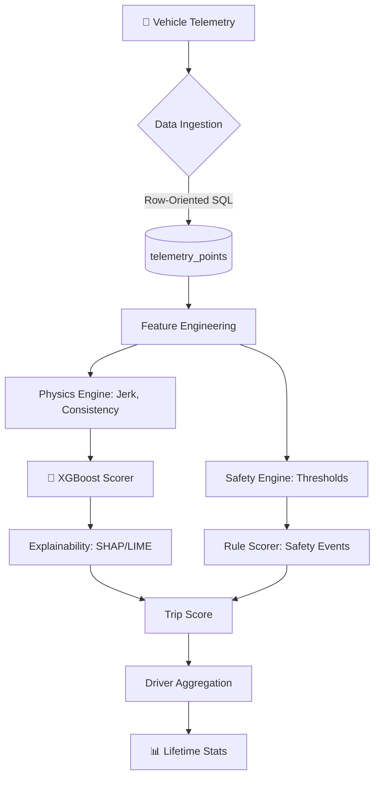

# TraceData Scoring System: Technical Walkthrough

> **Run the project first:** **[GETTING_STARTED.md](GETTING_STARTED.md)**.  
> **Production ML contract (3 features + MLflow):** see **[FEATURE_ENGINEERING.md](FEATURE_ENGINEERING.md)** and `src.mlops.production_window_training`.

This document is an architecture-oriented tour: storage, agents, XAI, and how pieces fit together.

## 🏗️ System Architecture

The system follows a hybrid approach: **ML for subjective patterns** (Smoothness) and **Rules for objective violations** (Safety).



---

## 🚀 Key Components

### 1. Data Engineering (Row-Oriented Telemetry)
Unlike standard JSON blob storage, we implemented **ADR 001: Row-Oriented Storage**. 
- **Benefit**: Each GPS/Accel point is a row in `telemetry_points`. 
- **Scalability**: Allows for direct SQL-level aggregates (e.g., `AVG(speed)`) and is production-ready for **TimescaleDB**.
- **Simulator**: `simulator.py` synthesizes 100+ trips across 5 unique driver profiles (Smooth, Jerky, Unsafe).

### 2. Feature Engineering (`features.py`)
We extract features that represent the "physics" of driving:
- **Acceleration Fluidity (Jerk)**: Measures how suddenly a driver changes acceleration. High jerk = jerky driving.
- **Driving Consistency**: The standard deviation of acceleration. Consistent drivers have lower variance.
- **Comfort Zone %**: The percentage of time a driver stays within the "Comfort Band" ([-0.5, 0.5] m/s²).

### 3. Bidirectional XAI (Driving Signature)
- **Local (Trips)**: SHAP impact scores are persisted in the `trips` table (`explanation_json`). Drivers see exactly what features affected a specific trip score.
- **Global (Drivers)**: We persist a **"Driving Signature"** in the `drivers` table (`explanation_json`). This represents the driver's aggregate behavior across all trips, identifying their unique driving style (e.g., "Consistently Smooth" or "Jerkiness Outlier").

### 4. Bidirectional Fairness (Cohort Context)
- **Fleet-Wide (Drivers)**: Fairness metadata (`fairness_metadata_json`) benchmarks each driver against their **Age** and **Experience** cohorts.
- **Trip-Level (Trips)**: Individual trips now include a `fairness_context` comparing the trip's performance against the driver's demographic group, ensuring that outliers are understood within their cohort's context.

### 5. The Behavior (Scoring) Agent (`src/agents/behavior/agent.py`)
This is the "Human Layer" of our AI.
- **Narrative Translation**: Instead of showing just JSON, the **Behavior Agent** fetches the persisted XAI and Fairness data and uses an LLM (or heuristic logic in MVP) to produce a **Coaching Narrative**.
- **Feature Filtering**: It intelligently filters out non-behavioral metadata like `base_value` to focus purely on actionable telemetry features (Consistency, Smoothness, etc.).
- **Professional UX**: The driver receives professional feedback, such as: *"Based on your recent trips, you are outperforming your age cohort by 29.86 points. This strong performance is primarily driven by your excellent driving consistency."*

### 6. ML Artifact Management
To maintain production hygiene, we've organized our ML artifacts:
- **`models/` Directory**: Centralized storage for trained model binaries (`.joblib`).
- **Standard**: Ensuring that `trainer.py`, `scoring.py`, and `explain.py` share a consistent path for the model state.

## 🧪 Verification & Results

### API Interaction Example
When a trip is posted to `/score-trip`, the system returns:
```json
{
  "trip_id": 101,
  "scores": {
    "smoothness": 92.4,
    "safety": 100.0,
    "overall": 96.2
  },
  "explanation": {
    "accel_fluidity": -2.5,
    "driving_consistency": -1.1,
    "comfort_zone_percent": +1.0,
    "base_value": 95.0
  }
}
```

### Driver Lifetime Stats
The system automatically aggregates scores to show lifetime performance:
- **Ahmad**: Smooth but occasionally breaks safety rules.
- **Linda**: High experience, extremely high safety and smoothness consistency.

---

## 📂 Project Structure

- `main.py`: FastAPI REST API.
- `scoring.py`: Orchestrates scores and driver aggregates.
- `features.py`: Physics-based feature extraction.
- `explain.py`: SHAP and LIME implementation.
- `fairness.py`: AIF360 Bias Auditing.
- `simulator.py`: Data synthesis & Database initialization.
- `trainer.py`: XGBoost model training logic.

## 🏁 Conclusion

The system is fully containerized and production-ready. By combining **Physics**, **ML**, and **Ethics (Fairness)**, we've built a scoring engine that is not only accurate but also transparent and unbiased.
